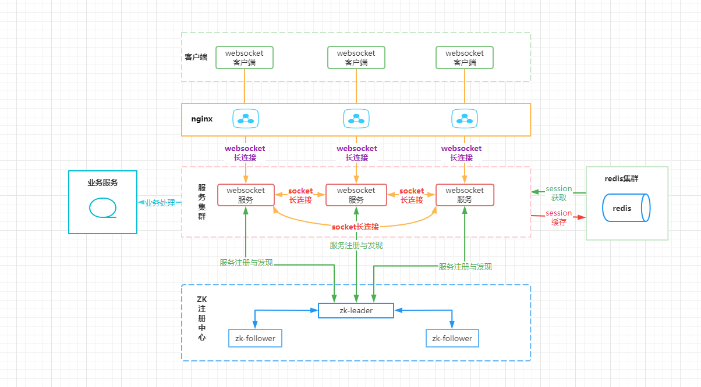

# 分布式WebSocket集群
## 一、概述
基于netty开发WebSocket集群
## 二、集群架构


## 三、涉及难点
### 1.协议区分

- （1）**背景**

浏览器与集群之间使用的事webSocket协议建立连接进行通讯。及群众各服务几点之间通过tcp Socket建立连接进行通讯，
因此集群要同时支持两种协议进行通讯。
- （2）**处理依据**

tcpSocket 与 websocket 的区别： tcpSocket是tcp的协议传输（**传输层**），直接进行tcp的三次握手：client向server发送请求报文，server回复ack报文并分配资源，client发送报文并分配资源，连接建立。
websocket是基于tcp的**应用层**协议，采用一次HTTP握手。websocket第一次是采用http握手的，他的请求头部是GET方式。所以我们需要根据这点来判断接收的消息是websocket还是tcp socket。
同时再使用netty的过程中可以根据需求动态增删处理器handler,基于以上两点对两种协议进行处理。

- （3）**具体实现**

```java
public class SocketChooseHandler extends ByteToMessageDecoder {
    /** 默认暗号长度为23 */
    private static final int MAX_LENGTH = 23;
    /** WebSocket握手的协议前缀 */
    private static final String WEBSOCKET_PREFIX = "GET /";

    @Override
    protected void decode(ChannelHandlerContext ctx, ByteBuf in, List<Object> out) throws Exception {
        String protocol = getBufStart(in);
        ChannelPipeline pipeline = ctx.pipeline();
        if (protocol.startsWith(WEBSOCKET_PREFIX)) {
            logger.info("webSocket协议");
            //增加webSocket协议处理handler
        }else {
            logger.info("tcpSocket协议");
            //增加tcpSocket协议处理handler
        }
        //移除当前handler
        pipeline.remove("socketChooseHandler");
    }

    private String getBufStart(ByteBuf in){
        int length = in.readableBytes();
        if (length > MAX_LENGTH) {
            length = MAX_LENGTH;
        }
        // 标记读位置
        in.markReaderIndex();
        byte[] content = new byte[length];
        in.readBytes(content);
        //一定要重新重置
        in.resetReaderIndex();
        return new String(content);
    }
```

### 2.webSocket认证与鉴权

浏览器客户端与集群之间连接时的认证与鉴权之的处理。参考文章：https://blog.csdn.net/weixin_36380516/article/details/107724626